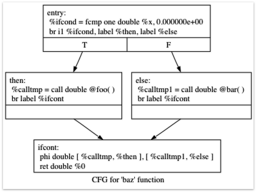

https://llvm.org/docs/tutorial/MyFirstLanguageFrontend/LangImpl05.html

이제 제어흐름을 만들 것이다. 분기와 반복을 추가하면 LLVM IR에서는 어떻게 표현되는 지 알아보는 장이 될 것이다.

# 5.2. If/Then/Else

언어 자체에 제어흐름 개념을 확장하는 건 렉서, 파서, AST, IR생성기에 다 넣어주면 된다.

if~else 같은걸 만들고 싶은데 지금 언어에서는 모든 statement가 표현식이다. 그래서 조건문들도 다 표현식처럼 값을 반환해야된다.

```cpp
if (x < 3) {
  return 1;
} else {
  return fib(x - 1) + fib(x - 2);
}
```

cpp에서 이랬던 게 각 조건이 표현식으로 묶이게 되면서 `if x < 3 then 1 else fib(x-1)+fib(x-2)` 값을 반환하는 형태가 되는데, 이건 3항 연산자랑 거의 비슷하다.

문제는 side-effect를 허용한다는 점이다. 순수함수형태를 위반한다는 의미인데 표현식 평가 중 외부 형태가 바뀌면 잘못된 result를 낼 수 있다는 의미가 된다.

## 5.2.1. If/Then/Else를 위한 Lexer 확장

우선 제어흐름문법을 인식하려면 그걸 토큰으로 받아올 수 있어야된다.

그래서 새 enum값을 추가한 뒤 lexer에 그 토큰을 인식하도록 수정한다.

```cpp
// control
tok_if = -6,
tok_then = -7,
tok_else = -8,
...
...
if (IdentifierStr == "def")
  return tok_def;
if (IdentifierStr == "extern")
  return tok_extern;
if (IdentifierStr == "if")
  return tok_if;
if (IdentifierStr == "then")
  return tok_then;
if (IdentifierStr == "else")
  return tok_else;
return tok_identifier;
```

이러면 렉서가 `if x < 3 then 1 else 2`이 코드에 대해서 아래처럼 쪼개준다.

```text
tok_if
tok_identifier(x)
'<'
tok_number(3)
tok_then
tok_number(1)
tok_else
tok_number(2)
```

토큰처리를 안했으면 if도 그냥 일반 identifier로 분리됐을 것이다. 그러니까, 변수로 처리됐을 거라는 의미.

## 5.2.2. If/Then/Else를 위한 AST 확장

이제 새로운 표현식을 나타내기 위해서 AST노드를 추가한다.

```cpp
/// IfExprAST - Expression class for if/then/else.
class IfExprAST : public ExprAST {
  std::unique_ptr<ExprAST> Cond, Then, Else;

public:
  IfExprAST(std::unique_ptr<ExprAST> Cond, std::unique_ptr<ExprAST> Then,
            std::unique_ptr<ExprAST> Else)
    : Cond(std::move(Cond)), Then(std::move(Then)), Else(std::move(Else)) {}

  Value *codegen() override;
};
```

복습을 하면, AST는 트리구조로 소스 코드를 표현한 것이다.

`if x < 3 then 1 else fib(x-1)` 는 아래 처럼 된다.

```cpp
IfExprAST
├── Cond: x < 3
├── Then: 1
└── Else: fib(x-1)
```

멤버 선언을 unique_ptr로 해놔서, Cond, Then, Else는 IfExprAST가 소유하고 있는 노드라고 읽을 수 있다.

## 5.2.3. If/Then/Else를 위한 Parser 확장

렉서에서 토큰 따오고, 만들 AST노드껍데기도 준비 됐으니 파싱로직을 구현해야 된다. 

```cpp
/// ifexpr ::= 'if' expression 'then' expression 'else' expression
static std::unique_ptr<ExprAST> ParseIfExpr() {
  getNextToken();  // eat the if.

  // condition.
  auto Cond = ParseExpression();
  if (!Cond)
    return nullptr;

  if (CurTok != tok_then)
    return LogError("expected then");
  getNextToken();  // eat the then

  auto Then = ParseExpression();
  if (!Then)
    return nullptr;

  if (CurTok != tok_else)
    return LogError("expected else");

  getNextToken();

  auto Else = ParseExpression();
  if (!Else)
    return nullptr;

  return std::make_unique<IfExprAST>(std::move(Cond), std::move(Then),
                                      std::move(Else));
}
```

조건문을 파싱하는 함수를 먼저 만들고

```cpp
static std::unique_ptr<ExprAST> ParsePrimary() {
  switch (CurTok) {
  default:
    return LogError("unknown token when expecting an expression");
  case tok_identifier:
    return ParseIdentifierExpr();
  case tok_number:
    return ParseNumberExpr();
  case '(':
    return ParseParenExpr();
  case tok_if:
    return ParseIfExpr();
  }
}
```

이걸 primary expression에 추가해준다. 주석의 `::=`는 좌항, 우항이 동일한 의미임을 뜻하는 기호다.

## 5.2.4. If/Then/Else를 위한 LLVM IR

이제 LLVM 코드 지원까지 해주면 일단 조건문 인식이 끝난다.

이런 코드를 입력한다고 해보자

```cpp
extern foo();
extern bar();
def baz(x) if x then foo() else bar();
```

최적화를 비활성화하면, 곧 Kaleidoscope에서 다음과 같은 코드가 생성될 것이다.
```llvm
declare double @foo()

declare double @bar()

define double @baz(double %x) {
entry:
  %ifcond = fcmp one double %x, 0.000000e+00
  br i1 %ifcond, label %then, label %else

then:       ; preds = %entry
  %calltmp = call double @foo()
  br label %ifcont

else:       ; preds = %entry
  %calltmp1 = call double @bar()
  br label %ifcont

ifcont:     ; preds = %else, %then
  %iftmp = phi double [ %calltmp, %then ], [ %calltmp1, %else ]
  ret double %iftmp
}
```


못보던 ir문법들이 생겼다.

entry 블록은 조건 표현식을 평가한다. fcmp one은 x의 결과를 0.0과 비교하는 ordered and not equal 연산이다.

then, else가 끝나면 ifcont로 내려오는데, 조건문 이후 실행될 코드를 담당한다.

ir코드까지 잘 만들어지는 걸 확인했으면, 값을 반환하는 일만 남았다.

코드는 어떤 표현식 값을 반환해야 하는지 SSA연산인 Phi 연산을 통해 알 수 있따. Phi 연산의 실행은 제어 흐름이 어떤 블록에서 왔는지 기억해야하고, 그에 해당하는 값을 선택해서 쓴다.

조건문처럼 if~then~else 같이 블록이 쪼개져있는 걸 적절히 가져오는 일을 phi노드를 통해 수행하는 것이다.

```text
entry
  ├── 조건 true  -> then
  └── 조건 false -> else

then
  └── ifcont

else
  └── ifcont

ifcont
  └── then/else 결과 중 하나 선택
```

이런 느낌. 근데 then이랑 else가 반환하는 값이 다를거라 이때 phi를 써야된다. 

```llvm
%iftmp = phi double [ %calltmp, %then ], [ %calltmp1, %else ]
```

then에서 왔으면 calltmp를, else에서 왔으면 calltmp1를 반환하는 코드. 그러니까 phi는 단순한 일반 함수 호출이 아니라 제어 흐름에 따라 값을 선택하는 LLVM IR 명령이라고 이해하면 되겠다.

## 5.2.5. If/Then/Else 코드 생성

IR코드를 생성하기 위해 codegen 메서드를 구현해줘야한다.

```cpp
Value *IfExprAST::codegen() {
  Value *CondV = Cond->codegen();
  if (!CondV)
    return nullptr;

  // Convert condition to a bool by comparing non-equal to 0.0.
  CondV = Builder->CreateFCmpONE(
      CondV, ConstantFP::get(*TheContext, APFloat(0.0)), "ifcond");
```

조건 표현식에 대한 코드를 생성한 다음, 그 값을 0과 비교해서 1비트 bool 값으로 만든다.

```cpp
Function *TheFunction = Builder->GetInsertBlock()->getParent();

// Create blocks for the then and else cases.  Insert the 'then' block at the
// end of the function.
BasicBlock *ThenBB =
    BasicBlock::Create(*TheContext, "then", TheFunction);
BasicBlock *ElseBB = BasicBlock::Create(*TheContext, "else");
BasicBlock *MergeBB = BasicBlock::Create(*TheContext, "ifcont");

Builder->CreateCondBr(CondV, ThenBB, ElseBB);
```

조건들과 관련된 블록을 사용한다.

먼저 현재 빌드 중인 Function 객체를 가져오고, 현재 블록의 부모 블록을 가져온다. 지금 블록을 호출한 함수쯤이 되겠다.

그다음 세 개의 block을 생성하는데, then의 경우 블록 생성자로 Function 객체를 넘기기 때문에 새 블록을 지정한 함수의 끝에 삽입하게 된다.

else 랑 ifcont는 아직 삽입되지않은 상태.

BB로 표현되는 BasicBlock은 LLVM IR에서 코드의 기본 단위읻네, 하나의 basic block은 끝에서만 분기한다. basic block의 끝에는 반드시 terminator가 있어야 한다는 게 중요한 규칙이다.

br(branch)이나, ret(return)같은게 블록을 마쳐주는 terminator이다.

```cpp
// Emit then value.
Builder->SetInsertPoint(ThenBB);

Value *ThenV = Then->codegen();
if (!ThenV)
  return nullptr;

Builder->CreateBr(MergeBB);
// Codegen of 'Then' can change the current block, update ThenBB for the PHI.
ThenBB = Builder->GetInsertBlock();
```

빌더를 then블록에 삽입하는데 then은 지금 비어있기 떄문에 block 시작부분에 삽입하는 것과 같다.

then block을 끝내기 위해 merge block으로 가는 무조건 분기를 생성하는데 이게 중요하다. merge block에서 phi ㅗㄴ드를 만들때 이게 어떻게 동작할지 알려주는 block/value 쌍을 설정해야된다. 근데 phi는 제어흐름에 따라 값선택을 기대하기 때문에 predecessor마다 entry를 기대한다.

근데 빌더가 코드를 삽입하는 대신 then의 시작으로 블록을 바꿀 수 있기때문에 이전에 정의한 ThenBB말고 그냥 현재 block을 다시 가져오는 것이다.

```cpp
// Emit else block.
TheFunction->insert(TheFunction->end(), ElseBB);
Builder->SetInsertPoint(ElseBB);

Value *ElseV = Else->codegen();
if (!ElseV)
  return nullptr;

Builder->CreateBr(MergeBB);
// codegen of 'Else' can change the current block, update ElseBB for the PHI.
ElseBB = Builder->GetInsertBlock();
```

else는 then 블록이랑 똑같은데 그냥 else 블록을 함수 끝에 추가한다는 것 밖에 없다.

```cpp
  // Emit merge block.
  TheFunction->insert(TheFunction->end(), MergeBB);
  Builder->SetInsertPoint(MergeBB);
  PHINode *PN =
    Builder->CreatePHI(Type::getDoubleTy(*TheContext), 2, "iftmp");

  PN->addIncoming(ThenV, ThenBB);
  PN->addIncoming(ElseV, ElseBB);
  return PN;
}
```

먼저 merge block을 Function 객체에 추가한다음 삽입 위치를 변경해서 생성 될 코드가 merge block에 들어가도록 한다.

# 5.3. for 루프 표현식

조건이 충족되고있다면 계속 로직을 반복 실행하는 루프 표현식도 만들어보자.

```llvm
extern putchard(char);
def printstar(n)
  for i = 1, i < n, 1.0 in
    putchard(42);  # ascii 42 = '*'

# print 100 '*' characters
printstar(100);
```

for문의 생김새가 조금 다르다 뿐이기 그냥 이해할만하다.

lexer에 토큰 추가하는건 동일하고, AST에는 조금 변화가 있다.

```cpp
/// ForExprAST - Expression class for for/in.
class ForExprAST : public ExprAST {
  std::string VarName;
  std::unique_ptr<ExprAST> Start, End, Step, Body;

public:
  ForExprAST(const std::string &VarName, std::unique_ptr<ExprAST> Start,
             std::unique_ptr<ExprAST> End, std::unique_ptr<ExprAST> Step,
             std::unique_ptr<ExprAST> Body)
    : VarName(VarName), Start(std::move(Start)), End(std::move(End)),
      Step(std::move(Step)), Body(std::move(Body)) {}

  Value *codegen() override;
};
```

시작값, 끝값, step이 추가되기때문이다.

## 5.3.3. for 루프를 위한 Parser 확장

```cpp
/// forexpr ::= 'for' identifier '=' expr ',' expr (',' expr)? 'in' expression
static std::unique_ptr<ExprAST> ParseForExpr() {
  getNextToken();  // eat the for.

  if (CurTok != tok_identifier)
    return LogError("expected identifier after for");

  std::string IdName = IdentifierStr;
  getNextToken();  // eat identifier.

  if (CurTok != '=')
    return LogError("expected '=' after for");
  getNextToken();  // eat '='.


  auto Start = ParseExpression();
  if (!Start)
    return nullptr;
  if (CurTok != ',')
    return LogError("expected ',' after for start value");
  getNextToken();

  auto End = ParseExpression();
  if (!End)
    return nullptr;

  // The step value is optional.
  std::unique_ptr<ExprAST> Step;
  if (CurTok == ',') {
    getNextToken();
    Step = ParseExpression();
    if (!Step)
      return nullptr;
  }

  if (CurTok != tok_in)
    return LogError("expected 'in' after for");
  getNextToken();  // eat 'in'.

  auto Body = ParseExpression();
  if (!Body)
    return nullptr;

  return std::make_unique<ForExprAST>(IdName, std::move(Start),
                                       std::move(End), std::move(Step),
                                       std::move(Body));
}
```

이 코드에서 재밌는 건 step을 선택적으로 처리한다는 점이다. 기본값 처리는 codegen에서 할거다.

## 5.3.5. for 루프 코드 생성

```cpp
Value *ForExprAST::codegen() {
  // Emit the start code first, without 'variable' in scope.
  Value *StartVal = Start->codegen();
  if (!StartVal)
    return nullptr;
```
시작 값을 먼저 정한다.

```cpp
// Make the new basic block for the loop header, inserting after current
// block.
Function *TheFunction = Builder->GetInsertBlock()->getParent();
BasicBlock *PreheaderBB = Builder->GetInsertBlock();
BasicBlock *LoopBB =
    BasicBlock::Create(*TheContext, "loop", TheFunction);

// Insert an explicit fall through from the current block to the LoopBB.
Builder->CreateBr(LoopBB);
```
if/then/else에서 본 것과 비슷하다.

loop으로 들어오는 블록을 기억해놔서 phi로 처리할 수 있다.

```cpp
// Start insertion in LoopBB.
Builder->SetInsertPoint(LoopBB);

// Start the PHI node with an entry for Start.
PHINode *Variable = Builder->CreatePHI(Type::getDoubleTy(*TheContext),
                                       2, VarName);
Variable->addIncoming(StartVal, PreheaderBB);
```
이제 루프의 preheader가 설정되었으므로, 루프 body 코드를 생성하도록 전환한다.
시작값에 대한 건 이미 알고 있으니까 StartVal을 phi노드에 추가해준다.

preheader는 루프 직전 블록, loop은 루프 본문, after는 루프 종료 뒤, backedge는 루프끝에서 시작으로 다시 돌아가는 것이다.

backedge가 있기 떄문에 phi노드는 StartVal, NextVar 모두 알아야하고, 그래서 처음에는 NextVar가 없지만 이후 루프 끝에서 NextVar를 incoming에 넣어준다.

```cpp
// Within the loop, the variable is defined equal to the PHI node.  If it
// shadows an existing variable, we have to restore it, so save it now.
Value *OldVal = NamedValues[VarName];
NamedValues[VarName] = Variable;

// Emit the body of the loop.  This, like any other expr, can change the
// current BB.  Note that we ignore the value computed by the body, but don't
// allow an error.
if (!Body->codegen())
  return nullptr;
```

for 루프는 심볼 테이블에 새 변수를 추가하는데, 함수 인자말고 루프 변수도 들어갈 수 있다. 스코프 밖에 동일한 이름이 있을 수 있는데 언어에 따라 shadowing을 허용할수도 있다. 이를 올바르게 처리하기 위해, 가려질 수 있는 기존 값을 OldVal에 기억해두면 된다. 기존 변수가 없다면 OldVal은 null.

shadowing이 거부되는 언어라면 그냥 null이 아닐경우 에러 내면 되고, 허용되는 언어면 사용이 끝난 다음 oldval을 다시 심볼 맵핑해주면 된다.

```cpp
// Emit the step value.
Value *StepVal = nullptr;
if (Step) {
  StepVal = Step->codegen();
  if (!StepVal)
    return nullptr;
} else {
  // If not specified, use 1.0.
  StepVal = ConstantFP::get(*TheContext, APFloat(1.0));
}

Value *NextVar = Builder->CreateFAdd(Variable, StepVal, "nextvar");
```
body가 다 처리되었으면 NextVar를 만들어서 incoming에 넣어준다. NextVar는 다음 반복에서 루프 변수가 가질 값이다.

```cpp
// Compute the end condition.
Value *EndCond = End->codegen();
if (!EndCond)
  return nullptr;

// Convert condition to a bool by comparing non-equal to 0.0.
EndCond = Builder->CreateFCmpONE(
    EndCond, ConstantFP::get(*TheContext, APFloat(0.0)), "loopcond");
```
End가 이름때문에 끝값이라고 인식될 수 있는데, 그냥 종료조건표현식이다.

```cpp
// Create the "after loop" block and insert it.
BasicBlock *LoopEndBB = Builder->GetInsertBlock();
BasicBlock *AfterBB =
    BasicBlock::Create(*TheContext, "afterloop", TheFunction);

// Insert the conditional branch into the end of LoopEndBB.
Builder->CreateCondBr(EndCond, LoopBB, AfterBB);

// Any new code will be inserted in AfterBB.
Builder->SetInsertPoint(AfterBB);
```

CreateCondBr은 종료 조건 값에 따라 루프를 다시 실행할건지 return 시킬건지 결정한다.

종료되었다면 이후 코드를 실행하기 위해 afterBB 위치로 삽입해주면된다.

```cpp
  // Add a new entry to the PHI node for the backedge.
  Variable->addIncoming(NextVar, LoopEndBB);

  // Restore the unshadowed variable.
  if (OldVal)
    NamedValues[VarName] = OldVal;
  else
    NamedValues.erase(VarName);

  // for expr always returns 0.0.
  return Constant::getNullValue(Type::getDoubleTy(*TheContext));
}
```

이 코드는 정리작업이다. 아까 shadowing처리했던 변수를 다시 원복하고, NextVar를 incoming으로 넣어준다.

이번 장은 완전히 SSA랑 Phi에 대한 설명이 주였다.

SSA는 “값은 한 번만 정의된다”는 IR 표현 방식이고, Phi는 “여러 제어 흐름 중 어디서 왔는지에 따라 값을 고르는 장치”다.

SSA는 좀 익숙한데, Phi가 좀 어렵다.

Phi가 조건문이 아님을 확실하게 인지하고 들어가면 좋다. phi자체가 조건을 검사하는 것이 아니며, phi의 기준은 조건이 아니라 직접 Basic Block이다.

알다시피 LLVM IR은 코드를 basic block 단위로 나눈다.

```llvm
entry:
  br i1 %cond, label %then, label %else

then:
  %a = call double @foo()
  br label %ifcont

else:
  %b = call double @bar()
  br label %ifcont

ifcont:
  %result = phi double [ %a, %then ], [ %b, %else ]
  ret double %result
```

이렇게 되어있으면 ifcont 입장에서는 들어가는 경로가 then, else 두개다. 이 경로에 따라 다르게 분류하는 것이 phi다. 좀 더 있어보이게 설명하면 합류지점에서 현재 블록에 도달하기 직전에 어떤 predecessor block을 거쳤는지, 그 block에 대응하는 값을 선택한다.

또 그렇기 때문에 일반 명령보다 앞에 있어야된다.


## 5.4. 보충 설명: 제어 흐름과 Phi 노드

### 1. Phi 노드의 위치 규칙
앞서 "일반 명령보다 앞에 있어야 된다"고 언급하셨는데, 이는 매우 엄격한 규칙입니다. **LLVM IR에서 `phi` 노드는 반드시 Basic Block의 가장 첫 부분(맨 위)에 위치해야 합니다.** 블록 내에 다른 일반 명령어(`add`, `call`, `br` 등)가 단 하나라도 등장한 이후에는 `phi` 노드를 삽입할 수 없습니다. LLVM의 `verifyFunction`이 이 규칙을 위반한 코드를 발견하면 즉시 에러를 발생시킵니다.

### 2. 수동 Phi 노드 생성의 한계와 `mem2reg` 기법 예고
현재 5장에서는 `If/Then/Else` 조건문이나 `For` 반복문의 루프 변수를 처리하기 위해 직접 AST 순회(codegen) 단계에서 `Builder->CreatePHI`를 호출하여 `phi` 노드를 수동으로 엮어주고 있습니다.
지금처럼 제어 흐름이 비교적 단순한 경우에는 직관적으로 경로 단위의 매핑(`PreheaderBB`, `LoopEndBB` 등)이 가능하지만, `break`나 `continue`, 중첩 루프, 복잡한 다중 조건문이 들어가면 AST 구조만으로 모든 `phi` 노드의 유입 경로(Incoming)를 완벽하게 추적하는 것은 거의 불가능에 가깝습니다.

**실제 상용 컴파일러(예: Clang) 및 LLVM 튜토리얼의 이후 과정(7장 가변 변수)에서는 어떻게 할까요?**
1. 제어 흐름마다 복잡하게 `phi` 노드를 계산하지 않습니다.
2. 대신, 지역 변수를 스택 영역에 할당(`alloca`)하고, 변수의 값이 바뀔 때마다 메모리에 저장(`store`) 및 읽어오기(`load`)를 합니다.
3. 이렇게 하면 SSA의 엄격한 규칙(값은 한 번만 할당됨)을 신경 쓰지 않고도 AST를 쉽게 IR로 변환할 수 있습니다.
4. 마지막으로 LLVM의 강력한 최적화 패스인 **`mem2reg` (Memory to Register)** 패스를 실행합니다. 이 패스가 스택 메모리에 접근하는 비효율적인 `alloca/load/store` 구조를 분석한 뒤, 가장 완벽하고 효율적인 **`phi` 노드로 알아서 변환**해 줍니다.

즉, 지금 5장에서 배우는 내용은 "LLVM IR 내부가 최종적으로 어떤 SSA와 Phi 형태를 띠게 되는지" 그 원리를 깊이 이해하기 위한 핵심 과정으로 이해하시면 좋습니다.
